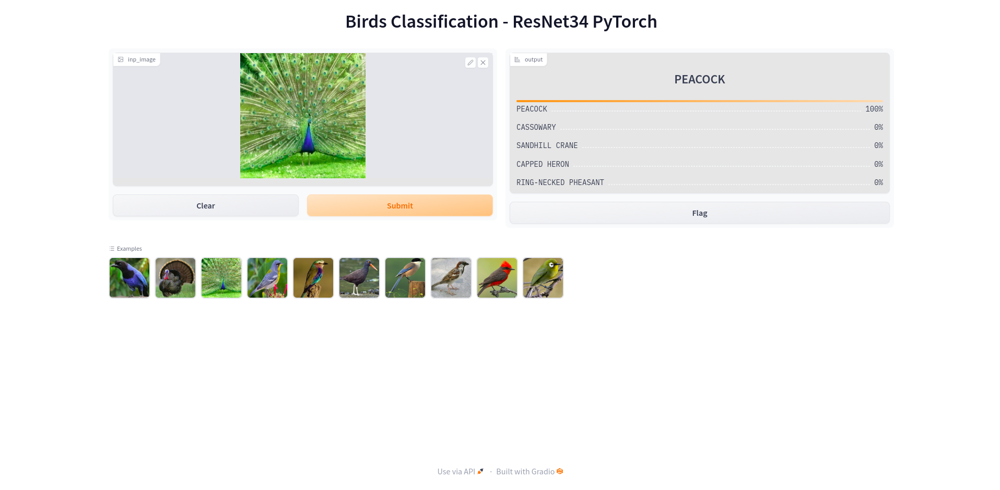
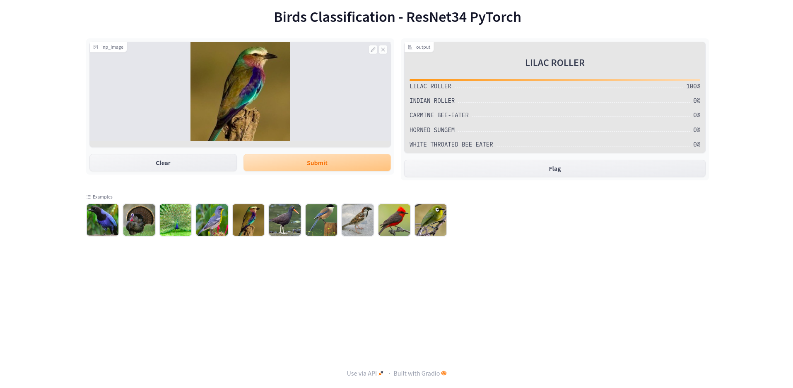

# Pytorch Resnet34 Bird Classification

The project is an implementation of the ResNet34 model as per the [Microsoft Research Paper](https://arxiv.org/abs/1512.03385). The model is build using PyTorch and is trained on the [Birds Classification Dataset](https://www.kaggle.com/datasets/gpiosenka/100-bird-species) from Kaggle. 

## 🚀 Getting Started

All the code for training the model and exporting to ONNX format is present in the [notebook](notebooks) folder or you can use this [Kaggle Notebook](https://www.kaggle.com/gauthamkrishnan119/pytorch-resnet34-birds-classification) for training the model. It took ~1.5 hours to train the model on the complete dataset using a P100 GPU. The [app.py](app.py) file contains the code for deploying the model using Gradio.

## 🤗 Demo

You can try out the model on [Hugging Face Spaces](https://huggingface.co/spaces/gauthamk/pytorch-resnet34-bird-classification)

## 🖥️ Sample Interface

